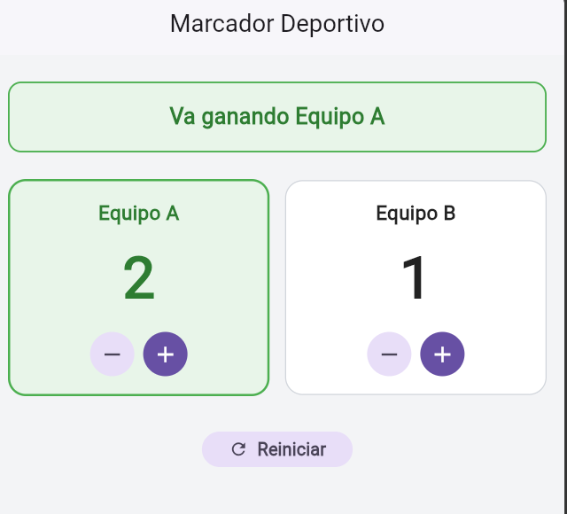
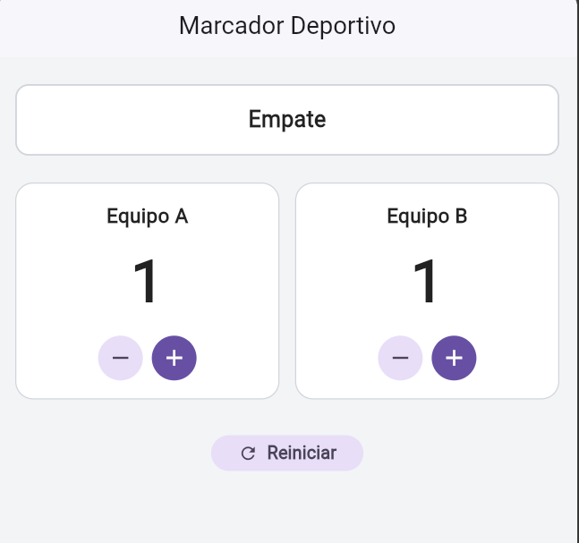

# Laboratorio: Marcador Deportivo

## 1. Evidencia de Funcionamiento:

A continuación se presentan las capturas de la aplicación en ejecución:

| Ventaja (Equipo A liderando) | Empate (0 - 0 inicial o igualdad) |
| :---: | :---: |
|  |  |

---

## 2. Pregunta Teórica:

* **¿Qué hace `setState` al presionar un botón?**  
  Al invocar `setState(() { ... })`, le notificamos al framework de Flutter que las variables que componen el estado interno del widget han cambiado. Esto marca el elemento correspondiente como *dirty* (sucio) y programa la ejecución del método `build()` en el siguiente cuadro de renderizado, redibujando la interfaz para reflejar los nuevos datos en pantalla (números actualizados, mensaje de ventaja y colores dinámicos).

* **¿Qué ocurriría si cambia los puntos sin llamarlo?**  
  La variable en memoria (por ejemplo, `_puntosA`) sí cambiaría su valor numérico, pero Flutter no recibiría la notificación del cambio. Como consecuencia, el método `build()` no se volvería a ejecutar y la interfaz visual permanecería congelada con los valores anteriores, rompiendo la reactividad y dejando la pantalla desactualizada frente al estado real del programa.

